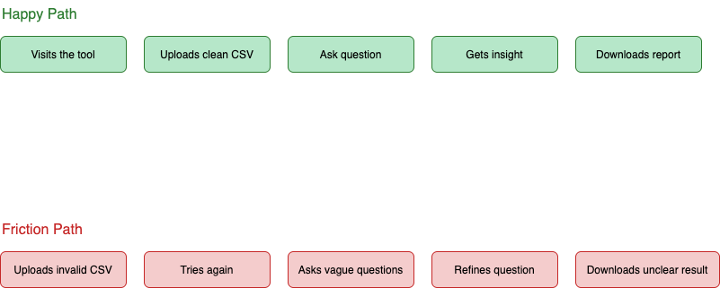

# User Journey Map – GenAI A/B Test Analyzer

This document outlines a dual-path user journey for the GenAI-powered A/B Test Analyzer. It helps us anticipate both smooth user experiences and potential friction points, ensuring robust design and error handling.

---

## ✅ Happy Path (Positive Flow)

| Step | User Action | System Response | Emotion |
|------|-------------|------------------|---------|
| 1 | Visits the tool | Clean, focused UI loads with guidance | Curious / Interested |
| 2 | Uploads a clean CSV file | File preview + validation confirmation | Confident |
| 3 | Ask question | GenAI analyzes the data | Hopeful |
| 4 | GenAI returns summary with insight + significance | “Variant B outperformed A with p = 0.03” | Empowered |
| 5 | User clicks "Download Report" | Report is generated and downloaded | Productive / Accomplished |

---

## ⚠️ Friction Path (Negative or Edge Flow)

| Step | User Action | System Response | Emotion |
|------|-------------|------------------|---------|
| 1 | Uploads invalid or incomplete CSV | Error: Missing columns | Frustrated |
| 2 | Uploads new file | File loads with partial validation | Uncertain |
| 3 | Asks vague question | Prompt: “Could you clarify your intent?” | Confused |
| 4 | Refines question | AI re-analyzes and responds | Encouraged |
| 5 | Insight is unclear | Summary lacks actionable confidence | Hesitant / Unfulfilled |

---

## 🖼️ Visual Journey Map

---

📌 This journey map informs product design, UX decisions, error messaging, and GenAI fallback strategies. It should evolve as we collect user feedback post-MVP.
